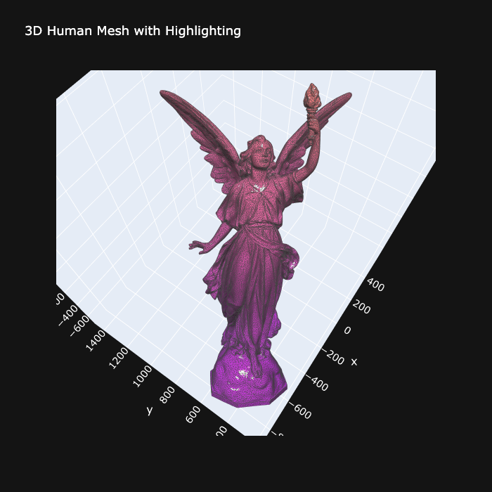
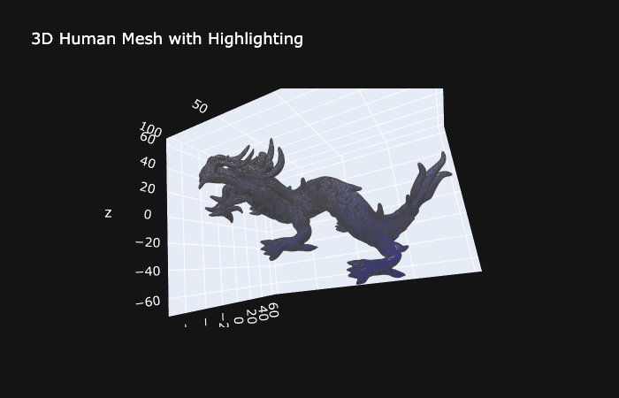

# xyz-rendering


Dash app for displaying and adding gradients to 3D models.

## How to run this app

(The following instructions apply to Posix/bash. Windows users should check
[here](https://docs.python.org/3/library/venv.html).)

First, clone this repository and open a terminal inside the root folder.

Create and activate a new virtual environment (recommended) by running
the following:

```bash
python3 -m venv myvenv
source myvenv/bin/activate
```

Install the requirements:

```bash
pip install -r requirements.txt
```

Run the app:

```bash
python app.py
```

Open a browser at http://127.0.0.1:8050.

## Screenshots

Here are some publically available 3D plots colored using this app :




## References

- [Dash Brain Viewer](https://github.com/plotly/dash-sample-apps/blob/main/apps/dash-brain-viewer) for app layout
- [Alec Jacobson](https://github.com/alecjacobson/common-3d-test-models) for list of common public 3D test models
